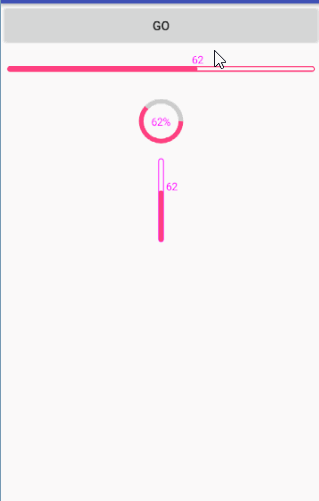

# VisualProgressbar

> **what is this?**

A tiny progressbar shows in the gif,not that awesome, but useful.

 

> **files**

It's really simple, so if you owned the follows, you owned all recently;
- LinearProgressBar.java 
- CircleProgressBar.java
- progressbar_attr.xml


# Licence
```
 Copyright (c) 2017 horseLai 

 Licensed under the Apache License, Version 2.0 (the "License");
 you may not use this file except in compliance with the License.
 You may obtain a copy of the License at

     http://www.apache.org/licenses/LICENSE-2.0

 Unless required by applicable law or agreed to in writing, software
 distributed under the License is distributed on an "AS IS" BASIS,
 WITHOUT WARRANTIES OR CONDITIONS OF ANY KIND, either express or implied.
 See the License for the specific language governing permissions and
limitations under the License.
```
